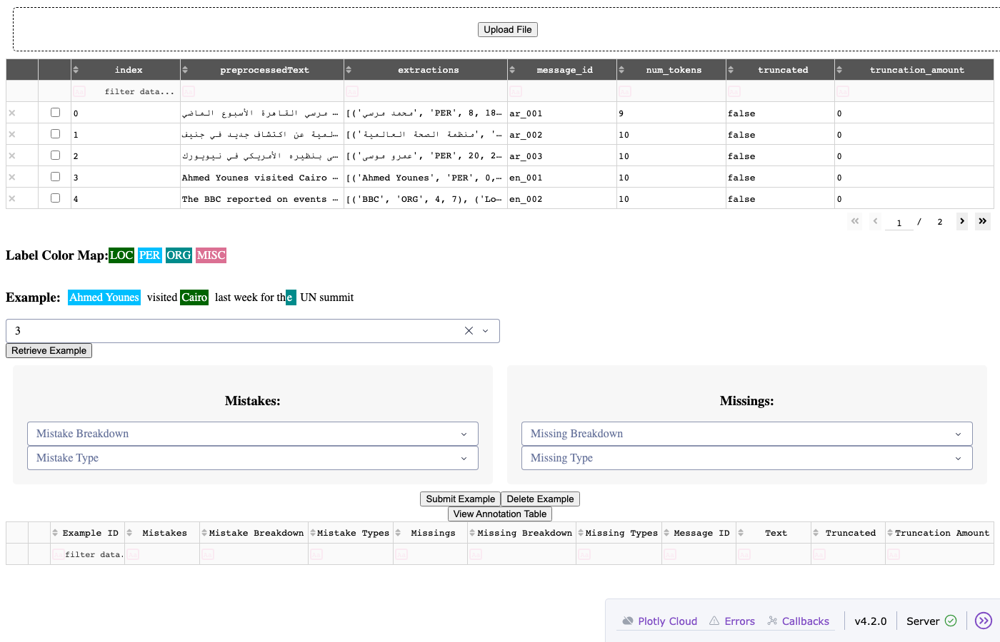

# multilingual-ner

Multilingual Named Entity Recognition toolkit — covering model benchmarking, large-scale extraction, and qualitative validation across a range of languages.

## Components

| Module | Description |
|---|---|
| `evaluation.py` | Benchmark NER models against labelled datasets using seqeval (entity-level) and sklearn (token-level) metrics |
| `extraction.py` | Run NER on unlabelled project data at scale using HuggingFace pipelines with batch processing |
| `validation.py` | Dash app for qualitative review of extraction outputs — colour-coded entity display, mistake and missing entity annotation |

## Evaluation workflow

Full methodology: [WORKFLOW.md](WORKFLOW.md)

Three-stage process:

1. **Model identification** — find candidate models via HuggingFace, check licensing and annotation scheme (CoNLL BIO format: PER/LOC/ORG/MISC)
2. **Benchmark ranking** — evaluate against standard datasets using seqeval and sklearn; exclude poor performers
3. **Project-specific validation** — run the validation app on a sample of project extractions; analysts review and annotate mistakes and missing entities

## Languages

Languages this workflow has been applied to:

- Afrikaans
- Arabic
- Bengali
- Bulgarian
- Czech
- Farsi
- French
- German
- Greek
- English
- Hausa
- Hindi
- Indonesian
- Japanese
- Malay
- Mandarin Chinese
- Portuguese
- Romanian
- Russian
- Serbo-Croatian
- Slovak
- Spanish
- Swahili
- Thai
- Turkish
- Twi
- Urdu
- Vietnamese
- Xhosa
- Zulu

## Validation app



The validation app is a Dash-based tool for qualitative review of NER extraction outputs. It is used in Stage 3 of the workflow — after benchmark ranking has produced a shortlist of candidate models, the app lets analysts review model output on real project data and annotate errors.

**How it works:**

1. **Upload** a CSV or JSONL file containing extraction outputs (columns: `preprocessedText`, `extractions`, `message_id`)
2. **Browse** the uploaded data in the table — all rows are shown with entity extraction strings
3. **Select an example** by ID and click **Retrieve Example** — the sentence is displayed with colour-coded entity spans: <span style="background:darkgreen">LOC</span> <span style="background:deepskyblue">PER</span> <span style="background:darkcyan">ORG</span> <span style="background:palevioletred">MISC</span>
4. **Annotate** using the two panels:
   - **Mistakes** — select which predicted entities are wrong and the error type (Entity Type, Entity Boundary, Truncation, Tokenization)
   - **Missings** — select words the model failed to tag and the missing entity type
5. **Submit** the annotation — saved to a JSON file in `annotation_outputs/`
6. **View Annotation Table** — see all submitted annotations in the table at the bottom, exportable for summary analysis

**Run it:**

```bash
python -m multilingual_ner.validation
# Opens at http://localhost:8050
```

A sample file for testing is at [`assets/dummy_ner_sample.csv`](assets/dummy_ner_sample.csv).

---

## Notebooks & documentation

| File | Description |
|---|---|
| [`template.ipynb`](template.ipynb) | Workflow template — all three stages with placeholders, adapt for any language |
| [`evaluation-template.md`](evaluation-template.md) | Structured template for documenting model selection, benchmark results and validation findings per language |
| [`benchmarks/ar/`](benchmarks/ar/) | Arabic worked example — CAMeL and hatmimoha benchmarks, evaluation notes |
| [`benchmarks/de/`](benchmarks/de/) | German benchmarks — gunghio/xlm, julian/roberta, fhswf/bert |

## Installation

```bash
# From GitHub
pip install git+https://github.com/ay94/multilingual-ner.git

# Local development
pip install -e .
```

## Quick start

### Benchmark evaluation

```python
from multilingual_ner.evaluation import ReadNERData, ModelEvaluation

reader = ReadNERData()
words, labels = reader.read_dataset("wikiann", {"O": 0, "B-PER": 1, "I-PER": 2, "B-ORG": 3, "I-ORG": 4, "B-LOC": 5, "I-LOC": 6}, lang="ar")

model = ModelEvaluation("hatmimoha/arabic-ner")
results = model.evaluate_model(words, labels)
print(results.get_classification("Seqeval"))
```

### Extraction

```python
import pandas as pd
from multilingual_ner.extraction import NamedEntityExtractions

df = pd.DataFrame({
    "text": ["Ahmed visited Cairo last week.", "The UN met in Geneva."],
    "message_id": ["msg_1", "msg_2"],
    "accountId": ["acc_1", "acc_1"],
})

extractor = NamedEntityExtractions(model_name="dslim/bert-base-NER", project_data=df)
json_schema, output_df, _, _ = extractor.extract_outputs()
print(output_df[["text", "PER", "LOC", "ORG"]])
```

### Validation app

```bash
python -m multilingual_ner.validation
# Opens at http://localhost:8050
# Upload a CSV with extraction outputs to review
```
