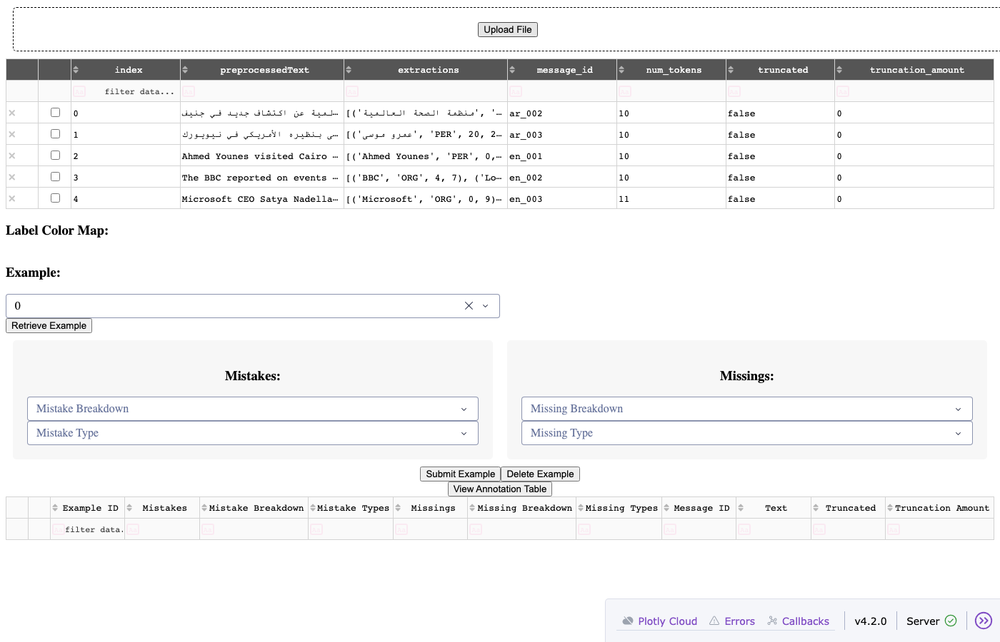
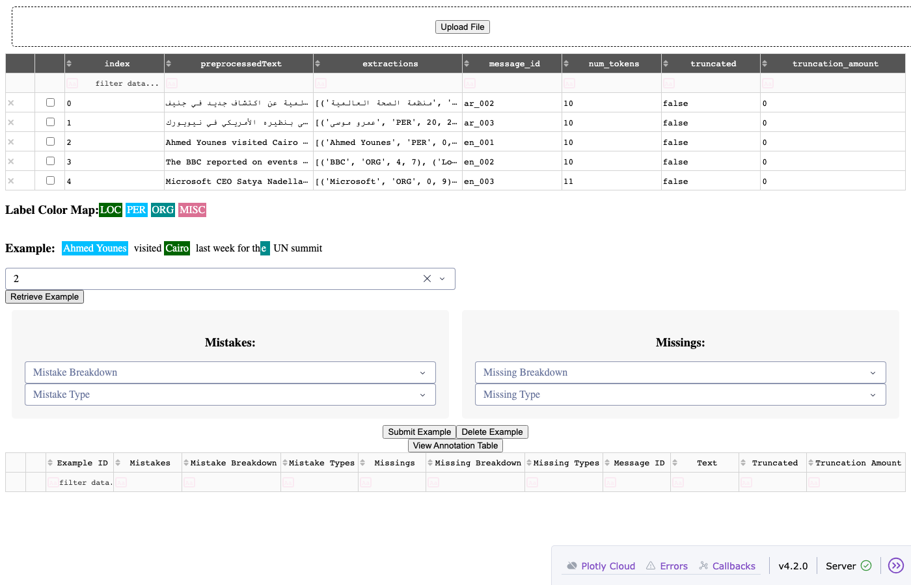
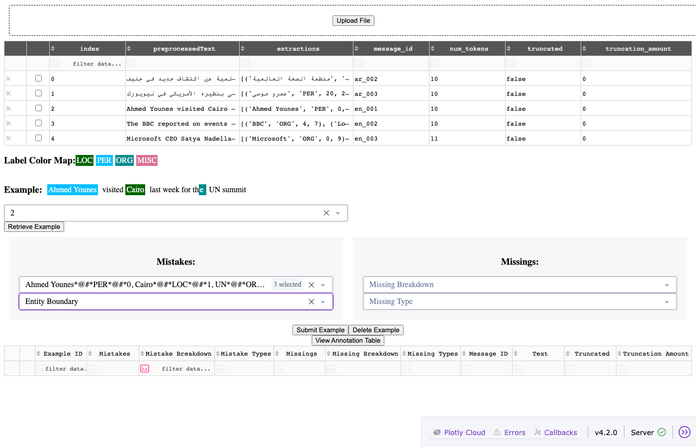
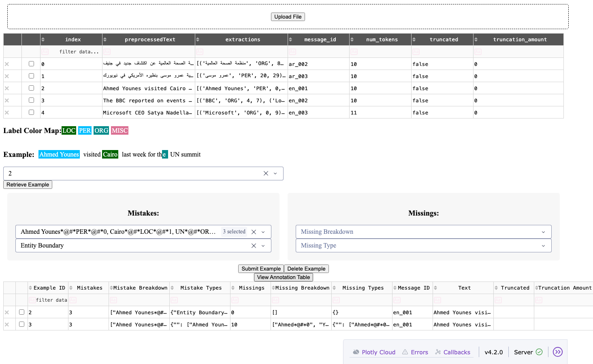

# multilingual-ner

Multilingual Named Entity Recognition toolkit — covering model benchmarking, large-scale extraction, and qualitative validation across a range of languages.

## Components

| Module | Description |
|---|---|
| `evaluation.py` | Benchmark NER models against labelled datasets using seqeval (entity-level) and sklearn (token-level) metrics |
| `extraction.py` | Run NER on unlabelled project data at scale using HuggingFace pipelines with batch processing |
| `validation.py` | Dash app for qualitative review of extraction outputs — colour-coded entity display, mistake and missing entity annotation |

## Evaluation workflow

Full methodology: [WORKFLOW.md](WORKFLOW.md)

Three-stage process:

1. **Model identification** — find candidate models via HuggingFace, check licensing and annotation scheme (CoNLL BIO format: PER/LOC/ORG/MISC)
2. **Benchmark ranking** — evaluate against standard datasets using seqeval and sklearn; exclude poor performers
3. **Project-specific validation** — run the validation app on a sample of project extractions; analysts review and annotate mistakes and missing entities

## Languages

Languages this workflow has been applied to:

- Afrikaans
- Arabic
- Bengali
- Bulgarian
- Czech
- Farsi
- French
- German
- Greek
- English
- Hausa
- Hindi
- Indonesian
- Japanese
- Malay
- Mandarin Chinese
- Portuguese
- Romanian
- Russian
- Serbo-Croatian
- Slovak
- Spanish
- Swahili
- Thai
- Turkish
- Twi
- Urdu
- Vietnamese
- Xhosa
- Zulu

## Validation app

A Dash-based tool for qualitative review of NER extraction outputs. Used in Stage 3 of the workflow — after benchmark ranking, analysts review model output on real project data and annotate errors before a final model decision is made.

**Run it:**

```bash
python -m multilingual_ner.validation
# Opens at http://localhost:8050
```

A sample file for testing is at [`assets/dummy_ner_sample.csv`](assets/dummy_ner_sample.csv).

---

**Step 1 — Upload extraction outputs**

Upload a CSV or JSONL file (columns: `preprocessedText`, `extractions`, `message_id`). The table shows all rows with truncated extraction strings.



---

**Step 2 — Retrieve an example**

Select a row ID and click **Retrieve Example**. The sentence renders with colour-coded entity spans. The label colour map shows which colour corresponds to each type (LOC, PER, ORG, MISC).



---

**Step 3 — Annotate mistakes and missing entities**

Two panels populate with the model's predicted entities (Mistakes) and the sentence tokens (Missings). Select which entities were wrong and which were missed, then choose the error type (Entity Type, Entity Boundary, Truncation, Tokenization).



---

**Step 4 — Submit and view annotation table**

Click **Submit Example**. Click **View Annotation Table** to see all submitted annotations — example ID, mistake and missing counts, breakdowns, message ID, and text. Saved to `annotation_outputs/` as JSON.



---

## Notebooks & documentation

| File | Description |
|---|---|
| [`template.ipynb`](template.ipynb) | Workflow template — all three stages with placeholders, adapt for any language |
| [`evaluation-template.md`](evaluation-template.md) | Structured template for documenting model selection, benchmark results and validation findings per language |
| [`benchmarks/ar/`](benchmarks/ar/) | Arabic worked example — CAMeL and hatmimoha benchmarks, evaluation notes |
| [`benchmarks/de/`](benchmarks/de/) | German benchmarks — gunghio/xlm, julian/roberta, fhswf/bert |

## Tests

The library has a unit test suite covering the core utility functions — no model downloads required to run them.

```bash
pip install pytest
pytest tests/ -v
```

**Coverage:**
- `ReadNERData` — file reading, sentence segmentation, token and label extraction
- `check_labels` — label set extraction across multi-sentence datasets
- `align_dataset` — label alignment for non-standard annotation schemes (including GermEval-style fine-grained tags)
- `NamedEntityExtractions` — post-processing (subword merging, entity grouping) and JSON schema generation, tested with mocked model output

23 tests, all passing.

## Installation

```bash
# From GitHub
pip install git+https://github.com/ay94/multilingual-ner.git

# Local development
pip install -e .
```

## Quick start

### Benchmark evaluation

```python
from multilingual_ner.evaluation import ReadNERData, ModelEvaluation

reader = ReadNERData()
words, labels = reader.read_dataset("wikiann", {"O": 0, "B-PER": 1, "I-PER": 2, "B-ORG": 3, "I-ORG": 4, "B-LOC": 5, "I-LOC": 6}, lang="ar")

model = ModelEvaluation("hatmimoha/arabic-ner")
results = model.evaluate_model(words, labels)
print(results.get_classification("Seqeval"))
```

### Extraction

```python
import pandas as pd
from multilingual_ner.extraction import NamedEntityExtractions

df = pd.DataFrame({
    "text": ["Ahmed visited Cairo last week.", "The UN met in Geneva."],
    "message_id": ["msg_1", "msg_2"],
    "accountId": ["acc_1", "acc_1"],
})

extractor = NamedEntityExtractions(model_name="dslim/bert-base-NER", project_data=df)
json_schema, output_df, _, _ = extractor.extract_outputs()
print(output_df[["text", "PER", "LOC", "ORG"]])
```

### Validation app

```bash
python -m multilingual_ner.validation
# Opens at http://localhost:8050
# Upload a CSV with extraction outputs to review
```
